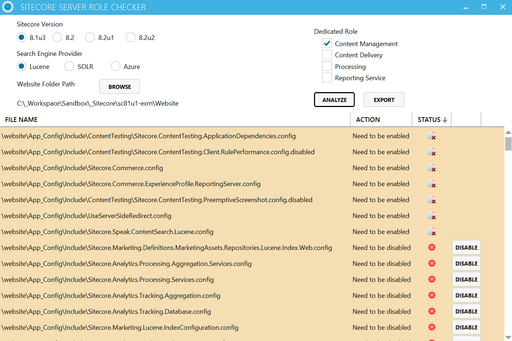

# Sitecore Server Role Checker

## How to install
Go to this [page](https://reyrahadian.github.io/Sitecore-Server-Role-Checker-ClickOnce/index.html) and download the ClickOnce installer to get the latest version.

# 

## Description
This tool will check the configuration files on the Sitecore website folder and let's you know if you've missed any configuration files to be enabled/disabled based on your selected server configuration roles.

This tool currently support the following Sitecore version
* 8.1 update 3
* 8.2 initial release
* 8.2 update 1
* 8.2 update 2

## How it works
Sitecore has an excel spreadsheet for configuring a dedicated server role available in the documentation site https://doc.sitecore.net/sitecore_experience_platform/setting_up__maintaining/xdb/configuring_servers/configure_a_content_delivery_server. This tool reads the csv version of that file and check your configuration files based on a specific role and reports back to you regarding the current configuration.

## What it doesn't do
1.	It will not check the updates on the configuration files at this moment
2.	Check the WFFM and EXM configurations

## How to use
1. Choose your Sitecore version 
2. Choose your search provider (Lucene/Solr/Azure)
3. Point to your website folder
4. Check the result

## Found an issue?
Create an issue ticket in Github or submit a PR that contains the issue fix
